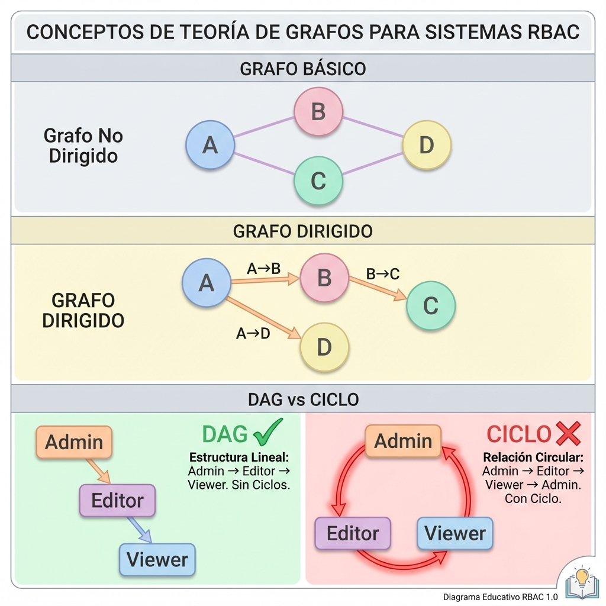

# 📚 Guía Completa de Conceptos - Sistema RBAC Basado en Grafos

Esta guía explica **TODOS** los conceptos necesarios para entender completamente este sistema, desde los fundamentos hasta los detalles de implementación.

---

## 📖 Tabla de Contenidos

1. [Conceptos Fundamentales](#1-conceptos-fundamentales)
2. [Teoría de Grafos Explicada](#2-teoría-de-grafos-explicada)
3. [RBAC - Control de Acceso Basado en Roles](#3-rbac---control-de-acceso-basado-en-roles)
4. [Domain-Driven Design (DDD)](#4-domain-driven-design-ddd)
5. [Arquitectura del Sistema](#5-arquitectura-del-sistema)
6. [Componentes del Sistema](#6-componentes-del-sistema)
7. [Flujo Completo del Sistema](#7-flujo-completo-del-sistema)
8. [Algoritmos de Grafos Utilizados](#8-algoritmos-de-grafos-utilizados)
9. [Ejemplos Prácticos](#9-ejemplos-prácticos)

---

## 1. Conceptos Fundamentales

### 1.1 ¿Qué es un Sistema de Permisos?

Imagina que tienes una aplicación web (como Facebook, Gmail, o un sistema de gestión empresarial). Necesitas controlar **quién puede hacer qué**.

**Ejemplo del mundo real:**
- **Alice** puede **ver** y **editar** posts
- **Bob** solo puede **ver** posts
- **Charlie** puede **ver**, **editar** y **eliminar** posts

### 1.2 Los 3 Conceptos Básicos

#### 🔑 **Permiso (Permission)**
Un permiso es **una acción específica sobre un recurso específico**.

**Formato:** `recurso:acción`

**Ejemplos:**
- `users:view` → Ver usuarios
- `users:edit` → Editar usuarios
- `users:delete` → Eliminar usuarios
- `posts:create` → Crear posts
- `orders:approve` → Aprobar órdenes

#### 👥 **Rol (Role)**
Un rol es **un conjunto de permisos** que se pueden asignar a usuarios.

**Ejemplos:**
- **Viewer** → Tiene permisos: `users:view`, `posts:view`
- **Editor** → Tiene permisos: `users:edit`, `posts:edit`
- **Admin** → Tiene permisos: `users:delete`, `posts:delete`

#### 👤 **Usuario (User)**
Una persona que usa el sistema y tiene uno o más roles asignados.

**Ejemplo:**
- **Alice** tiene el rol **Editor**
- **Bob** tiene el rol **Viewer**
- **Charlie** tiene el rol **Admin**

---

## 2. Teoría de Grafos Explicada

### 2.1 ¿Qué es un Grafo?

Un **grafo** es simplemente una forma de representar **relaciones entre cosas**.

**Componentes:**
- **Nodos (Vértices)**: Las "cosas" (en nuestro caso, roles o permisos)
- **Aristas (Edges)**: Las "relaciones" entre las cosas (en nuestro caso, herencia)

### 2.2 Ejemplo Visual Simple

```
    A
   / \
  B   C
   \ /
    D
```

Aquí:
- **Nodos**: A, B, C, D
- **Aristas**: A→B, A→C, B→D, C→D

### 2.3 Grafo Dirigido (Directed Graph)

En un grafo dirigido, las relaciones tienen **dirección** (como una flecha).

```
A → B → C
```

Esto significa:
- A apunta a B
- B apunta a C
- Pero B NO apunta a A (es unidireccional)

### 2.4 DAG (Directed Acyclic Graph)

**DAG** = Grafo Dirigido Acíclico

**Acíclico** significa **sin ciclos** (no puedes volver al punto de partida siguiendo las flechas).

#### ✅ Ejemplo VÁLIDO (DAG):
```
    Admin
      ↓
    Editor
      ↓
    Viewer
```

Puedes ir de Admin → Editor → Viewer, pero NO puedes volver a Admin.

#### ❌ Ejemplo INVÁLIDO (tiene ciclo):
```
    Admin
      ↓
    Editor
      ↓
    Viewer
      ↓
    Admin  ← ¡CICLO!
```

Esto crearía un **ciclo infinito** y causaría problemas.

#### 📊 Diagrama Visual de Conceptos de Grafos



### 2.5 ¿Por qué usamos Grafos en RBAC?

Porque los roles forman **jerarquías naturales**:

```
        SuperAdmin
           /  \
          /    \
      Admin   Manager
        |       |
        |       |
     Editor   Viewer
```

**Herencia de Permisos:**
- **SuperAdmin** hereda TODOS los permisos de Admin y Manager
- **Admin** hereda todos los permisos de Editor
- **Manager** hereda todos los permisos de Viewer

### 2.6 Algoritmos de Grafos Básicos

#### 🔍 **DFS (Depth-First Search) - Búsqueda en Profundidad**

Imagina que estás explorando un laberinto y siempre vas **lo más profundo posible** antes de retroceder.

**Ejemplo:**
```
    1
   / \
  2   3
 /
4
```

**Orden DFS:** 1 → 2 → 4 → 3

**Uso en nuestro sistema:** Detectar ciclos en la jerarquía de roles.

#### 🔍 **BFS (Breadth-First Search) - Búsqueda en Amplitud**

Exploras **nivel por nivel**, como ondas en el agua.

**Ejemplo:**
```
    1
   / \
  2   3
 /
4
```

**Orden BFS:** 1 → 2 → 3 → 4

**Uso en nuestro sistema:** Encontrar todos los roles ancestros (padres, abuelos, etc.).

---

## 3. RBAC - Control de Acceso Basado en Roles

### 3.1 ¿Qué problema resuelve RBAC?

**Sin RBAC (enfoque ingenuo):**
```typescript
// Asignar permisos directamente a cada usuario
alice.permissions = ['users:view', 'users:edit', 'posts:view', 'posts:edit'];
bob.permissions = ['users:view', 'users:edit', 'posts:view', 'posts:edit'];
charlie.permissions = ['users:view', 'users:edit', 'posts:view', 'posts:edit'];
```

**Problemas:**
- ❌ Repetición masiva
- ❌ Difícil de mantener (si cambias un permiso, debes actualizar TODOS los usuarios)
- ❌ Propenso a errores

**Con RBAC:**
```typescript
// Crear un rol con permisos
editorRole.permissions = ['users:view', 'users:edit', 'posts:view', 'posts:edit'];

// Asignar rol a usuarios
alice.roles = ['Editor'];
bob.roles = ['Editor'];
charlie.roles = ['Editor'];
```

**Ventajas:**
- ✅ Sin repetición
- ✅ Fácil de mantener (cambias el rol, todos los usuarios se actualizan)
- ✅ Menos errores

### 3.2 RBAC con Jerarquía (Graph-Based RBAC)

Llevamos RBAC un paso más allá: **los roles pueden heredar de otros roles**.

```
    Admin
      ↓ (hereda de)
    Editor
      ↓ (hereda de)
    Viewer
```

**Permisos:**
- **Viewer**: `users:view`, `posts:view`
- **Editor**: `users:edit`, `posts:edit` + **hereda** de Viewer
- **Admin**: `users:delete`, `posts:delete` + **hereda** de Editor

**Resultado:**
- **Viewer** tiene: `users:view`, `posts:view`
- **Editor** tiene: `users:view`, `posts:view`, `users:edit`, `posts:edit`
- **Admin** tiene: `users:view`, `posts:view`, `users:edit`, `posts:edit`, `users:delete`, `posts:delete`

#### 📊 Diagrama Visual de Jerarquía RBAC


---

## 4. Domain-Driven Design (DDD)

### 4.1 ¿Qué es DDD?

DDD es una forma de **organizar el código** para que refleje el **dominio del negocio**.

**Principio clave:** El código debe hablar el mismo lenguaje que los expertos del negocio.

### 4.2 Conceptos DDD en Nuestro Sistema

#### 📦 **Entity (Entidad)**

Una entidad es **algo con identidad única** que persiste en el tiempo.

**Características:**
- Tiene un **ID único**
- Puede cambiar sus propiedades
- Se compara por ID, no por propiedades

**Ejemplos en nuestro sistema:**
- `User` (identificado por `UserId`)
- `Role` (identificado por `RoleId`)
- `Permission` (identificado por `PermissionId`)

```typescript
// Dos usuarios con el mismo nombre son DIFERENTES si tienen IDs diferentes
const user1 = new User(UserId.create(), "Alice", "alice@example.com");
const user2 = new User(UserId.create(), "Alice", "alice@example.com");

user1.equals(user2); // false (IDs diferentes)
```

#### 💎 **Value Object (Objeto de Valor)**

Un value object es **algo sin identidad**, se compara por sus valores.

**Características:**
- **Inmutable** (no puede cambiar después de crearse)
- Se compara por **valor**, no por identidad
- No tiene ID

**Ejemplos en nuestro sistema:**
- `ResourceAction` (ej: `users:edit`)
- `Email` (ej: `alice@example.com`)
- `UserId`, `RoleId`, `PermissionId` (aunque son IDs, son value objects)

```typescript
// Dos ResourceAction con los mismos valores son IGUALES
const action1 = ResourceAction.create("users", "edit");
const action2 = ResourceAction.create("users", "edit");

action1.equals(action2); // true (mismos valores)
```

**¿Por qué inmutables?**
```typescript
// ❌ MALO: Mutable
const email = new Email("alice@example.com");
email.value = "hacker@evil.com"; // ¡Peligroso!

// ✅ BUENO: Inmutable
const email = Email.create("alice@example.com");
// No hay forma de cambiar el valor
// Si necesitas otro email, creas uno nuevo
const newEmail = Email.create("bob@example.com");
```

#### 🏢 **Domain Service (Servicio de Dominio)**

Lógica de negocio que **no pertenece a una entidad específica**.

**Ejemplos en nuestro sistema:**
- `RoleGraphService`: Algoritmos de grafos para roles
- `PermissionGraphService`: Algoritmos de grafos para permisos

**¿Por qué no en la entidad?**
```typescript
// ❌ MALO: Lógica compleja en la entidad
class Role {
  calculateAllInheritedPermissions(allRoles: Map<string, Role>) {
    // Algoritmo BFS complejo aquí...
  }
}

// ✅ BUENO: Lógica en servicio de dominio
class RoleGraphService {
  calculateEffectivePermissions(roles: Set<Role>, allRoles: Map<string, Role>) {
    // Algoritmo BFS complejo aquí...
  }
}
```

#### 🗄️ **Repository (Repositorio)**

Abstracción para **guardar y recuperar entidades** de la base de datos.

**Patrón clave:** El dominio NO sabe nada sobre la base de datos.

```typescript
// Interfaz (en el dominio)
interface UserRepository {
  save(user: User): Promise<void>;
  findById(id: UserId): Promise<User | null>;
}

// Implementación (en infraestructura)
class MongoUserRepository implements UserRepository {
  async save(user: User): Promise<void> {
    // Guardar en MongoDB
  }
  
  async findById(id: UserId): Promise<User | null> {
    // Buscar en MongoDB
  }
}
```

---

## 5. Arquitectura del Sistema

### 5.1 Arquitectura Hexagonal (Puertos y Adaptadores)

```
┌─────────────────────────────────────────────────┐
│                 APLICACIÓN                      │
│  (Use Cases: CreateUser, CheckPermission, etc.) │
└────────────────┬────────────────────────────────┘
                 │
┌────────────────▼────────────────────────────────┐
│                  DOMINIO                        │
│  (Entities, Value Objects, Domain Services)     │
│  ┌──────────────────────────────────────────┐   │
│  │ User, Role, Permission                   │   │
│  │ RoleGraphService, PermissionGraphService │   │
│  │ Repository Interfaces (Puertos)          │   │
│  └──────────────────────────────────────────┘   │
└────────────────┬────────────────────────────────┘
                 │
┌────────────────▼────────────────────────────────┐
│             INFRAESTRUCTURA                     │
│  (Repository Implementations - Adaptadores)     │
│  ┌──────────────────────────────────────────┐   │
│  │ MongoUserRepository                      │   │
│  │ MongoRoleRepository                      │   │
│  │ MongoPermissionRepository                │   │
│  └──────────────────────────────────────────┘   │
└─────────────────────────────────────────────────┘
```

**Ventajas:**
- ✅ **Testeable**: Puedes testear el dominio sin base de datos
- ✅ **Flexible**: Puedes cambiar de MongoDB a PostgreSQL sin tocar el dominio
- ✅ **Mantenible**: Cada capa tiene responsabilidades claras

#### 📊 Diagrama Visual de Arquitectura Hexagonal


### 5.2 Flujo de Dependencias

```
Infraestructura → Aplicación → Dominio
```

**Regla de oro:** Las dependencias siempre apuntan **hacia el dominio**.

- ❌ El dominio NO puede depender de infraestructura
- ✅ La infraestructura SÍ puede depender del dominio

---

## 6. Componentes del Sistema

### 6.1 Value Object: `ResourceAction`

**Propósito:** Representar una acción sobre un recurso de forma type-safe.

**Archivo:** `src/roles/domain/value-objects/ResourceAction.ts`

```typescript
export class ResourceAction {
    private readonly resource: string;  // "users"
    private readonly action: string;    // "edit"
    
    // Constructor privado → Solo se puede crear con métodos estáticos
    private constructor(resource: string, action: string) {
        this.resource = resource;
        this.action = action;
    }
    
    // Crear desde strings separados
    static create(resource: string, action: string): ResourceAction {
        if (!resource || resource.trim().length === 0) {
            throw new Error('Resource cannot be empty');
        }
        if (!action || action.trim().length === 0) {
            throw new Error('Action cannot be empty');
        }
        return new ResourceAction(
            resource.toLowerCase(),  // Normaliza a minúsculas
            action.toLowerCase()
        );
    }
    
    // Crear desde string "resource:action"
    static fromString(value: string): ResourceAction {
        const parts = value.split(':');
        if (parts.length !== 2) {
            throw new Error(`Invalid format: ${value}`);
        }
        return ResourceAction.create(parts[0], parts[1]);
    }
    
    // Convertir a string
    toString(): string {
        return `${this.resource}:${this.action}`;
    }
    
    // Comparar por valor
    equals(other: ResourceAction): boolean {
        return this.resource === other.resource && 
               this.action === other.action;
    }
    
    // Soporte de wildcards
    matches(pattern: ResourceAction): boolean {
        const resourceMatches = 
            pattern.resource === '*' || this.resource === pattern.resource;
        const actionMatches = 
            pattern.action === '*' || this.action === pattern.action;
        return resourceMatches && actionMatches;
    }
}
```

**Ejemplos de uso:**

```typescript
// Crear
const action1 = ResourceAction.create("users", "edit");
const action2 = ResourceAction.fromString("users:edit");

// Comparar
action1.equals(action2); // true

// Wildcards
const viewUsers = ResourceAction.create("users", "view");
const allUsers = ResourceAction.create("users", "*");
const allView = ResourceAction.create("*", "view");

viewUsers.matches(allUsers);  // true (users:* incluye users:view)
viewUsers.matches(allView);   // true (*:view incluye users:view)
```

### 6.2 Entity: `Permission`

**Propósito:** Representa un permiso en el sistema.

**Archivo:** `src/roles/domain/Permission.ts`

```typescript
export class Permission {
    private readonly id: PermissionId;
    private readonly resourceAction: ResourceAction;  // ← Contiene ResourceAction
    private readonly description: string;
    private readonly createdAt: Date;
    private readonly parentPermissions: Set<PermissionId>;  // Para jerarquía
    
    // Crear nuevo permiso
    static create(
        resourceAction: ResourceAction,
        description: string,
    ): Permission {
        return new Permission(
            PermissionId.create(),  // Genera UUID
            resourceAction,
            description,
            new Date(),
        );
    }
    
    // Reconstruir desde DB
    static reconstitute(
        id: PermissionId,
        resourceAction: ResourceAction,
        description: string,
        createdAt: Date,
        parentPermissions: Set<PermissionId>,
    ): Permission {
        return new Permission(
            id,
            resourceAction,
            description,
            createdAt,
            parentPermissions,
        );
    }
    
    getResourceAction(): ResourceAction {
        return this.resourceAction;
    }
}
```

### 6.3 Entity: `Role`

**Propósito:** Representa un rol con permisos y jerarquía.

**Archivo:** `src/roles/domain/Role.ts`

```typescript
export class Role {
    private readonly id: RoleId;
    private name: string;
    private description: string;
    private readonly parentRoles: Set<RoleId>;      // ← Jerarquía (grafo)
    private readonly permissions: Set<PermissionId>; // ← Permisos directos
    
    // Agregar rol padre (herencia)
    addParentRole(parentId: RoleId): void {
        if (this.id.equals(parentId)) {
            throw new Error('Role cannot be its own parent');
        }
        this.parentRoles.add(parentId);
    }
    
    // Otorgar permiso
    grantPermission(permissionId: PermissionId): void {
        this.permissions.add(permissionId);
    }
}
```

### 6.4 Entity: `User`

**Propósito:** Representa un usuario con roles asignados.

**Archivo:** `src/users/domain/User.ts`

```typescript
export class User {
    private readonly id: UserId;
    private name: string;
    private readonly email: Email;
    private readonly assignedRoles: Set<RoleId>;  // ← Roles del usuario
    
    // Asignar rol
    assignRole(roleId: RoleId): void {
        this.assignedRoles.add(roleId);
    }
}
```

### 6.5 Domain Service: `RoleGraphService`

**Propósito:** Algoritmos de grafos para roles.

**Archivo:** `src/roles/domain/services/RoleGraphService.ts`

**Métodos principales:**

#### 1. `detectCircularDependency()` - Detectar Ciclos

```typescript
detectCircularDependency(role: Role, allRoles: Map<string, Role>): boolean
```

**¿Qué hace?** Usa DFS para detectar si hay un ciclo en la jerarquía.

**Ejemplo:**
```
Admin → Editor → Viewer → Admin  ← ¡CICLO!
```

#### 2. `getAllAncestorRoles()` - Obtener Ancestros

```typescript
getAllAncestorRoles(role: Role, allRoles: Map<string, Role>): Set<RoleId>
```

**¿Qué hace?** Usa BFS para encontrar todos los roles padres (ancestros).

**Ejemplo:**
```
        SuperAdmin
           /  \
        Admin  Manager
          |
        Editor

getAllAncestorRoles(Editor) → [Admin, SuperAdmin]
```

#### 3. `calculateEffectivePermissions()` - Calcular Permisos Efectivos

```typescript
calculateEffectivePermissions(
    roles: Set<Role>, 
    allRoles: Map<string, Role>
): Set<PermissionId>
```

**¿Qué hace?** Calcula TODOS los permisos de un conjunto de roles, incluyendo los heredados.

**Ejemplo:**
```
Viewer: [users:view, posts:view]
Editor: [users:edit, posts:edit] + hereda de Viewer
Admin: [users:delete] + hereda de Editor

calculateEffectivePermissions([Admin]) → 
  [users:view, posts:view, users:edit, posts:edit, users:delete]
```

---

## 7. Flujo Completo del Sistema

### 7.1 Crear un Permiso

```typescript
// Use Case: CreatePermission
const command = {
    resource: 'users',
    action: 'edit',
    description: 'Edit users'
};

// 1. Crear ResourceAction (Value Object)
const resourceAction = ResourceAction.create(
    command.resource,  // "users"
    command.action     // "edit"
);
// Resultado: ResourceAction { resource: "users", action: "edit" }

// 2. Verificar si ya existe
const existing = await permissionRepository.findByResourceAction(resourceAction);
if (existing) {
    throw new Error('Permission already exists');
}

// 3. Crear entidad Permission
const permission = Permission.create(resourceAction, command.description);
// Resultado: Permission { 
//   id: PermissionId("uuid-123"),
//   resourceAction: ResourceAction("users:edit"),
//   description: "Edit users"
// }

// 4. Guardar en repositorio
await permissionRepository.save(permission);

// 5. En MongoDB se guarda como:
// {
//   id: "uuid-123",
//   resource: "users",    ← Descompuesto
//   action: "edit",       ← Descompuesto
//   description: "Edit users",
//   createdAt: "2024-01-01T00:00:00Z",
//   parentPermissions: []
// }
```

### 7.2 Crear Jerarquía de Roles

```typescript
// 1. Crear roles
const viewer = await createRole.execute({ 
    name: 'Viewer', 
    description: 'Can view' 
});

const editor = await createRole.execute({ 
    name: 'Editor', 
    description: 'Can edit' 
});

const admin = await createRole.execute({ 
    name: 'Admin', 
    description: 'Full access' 
});

// 2. Establecer jerarquía
await setRoleParent.execute({
    roleId: editor.getId().toString(),
    parentRoleId: viewer.getId().toString()
});
// Editor → Viewer

await setRoleParent.execute({
    roleId: admin.getId().toString(),
    parentRoleId: editor.getId().toString()
});
// Admin → Editor → Viewer

// 3. Intentar crear ciclo (será rechazado)
await setRoleParent.execute({
    roleId: viewer.getId().toString(),
    parentRoleId: admin.getId().toString()
});
// ❌ Error: "Would create circular dependency"
```

### 7.3 Verificar Permisos de Usuario

```typescript
// Use Case: CheckUserPermission
const query = {
    userId: "user-uuid-123",
    resource: "users",
    action: "edit"
};

// 1. Crear ResourceAction desde query
const resourceAction = ResourceAction.create(query.resource, query.action);

// 2. Buscar usuario
const user = await userRepository.findById(UserId.fromString(query.userId));

// 3. Obtener roles del usuario
const userRoles = await roleRepository.findByIds(
    Array.from(user.getAssignedRoles())
);
// Ejemplo: user tiene rol [Admin]

// 4. Obtener todos los roles del sistema
const allRoles = await roleRepository.findAll();
const rolesMap = new Map(allRoles.map(r => [r.getId().toString(), r]));

// 5. Calcular permisos efectivos (con herencia)
const effectivePermissions = roleGraphService.calculateEffectivePermissions(
    new Set(userRoles),
    rolesMap
);
// Resultado: [users:view, posts:view, users:edit, posts:edit, users:delete]

// 6. Obtener todos los permisos
const allPermissions = await permissionRepository.findAll();
const permissionsMap = new Map(
    allPermissions.map(p => [p.getId().toString(), p])
);

// 7. Verificar si algún permiso efectivo coincide
for (const permissionId of effectivePermissions) {
    const permission = permissionsMap.get(permissionId.toString());
    
    if (permission && permission.getResourceAction().equals(resourceAction)) {
        return {
            hasPermission: true,
            reason: 'Permission granted through role assignment'
        };
    }
}

return {
    hasPermission: false,
    reason: 'No matching permission found'
};
```

#### 📊 Diagrama Visual del Flujo Completo


---

## 8. Algoritmos de Grafos Utilizados

### 8.1 DFS para Detección de Ciclos

**Pseudocódigo:**

```
función detectarCiclo(nodo, visitados, pilaRecursión):
    marcar nodo como visitado
    agregar nodo a pilaRecursión
    
    para cada vecino de nodo:
        si vecino no está visitado:
            si detectarCiclo(vecino, visitados, pilaRecursión):
                retornar verdadero
        sino si vecino está en pilaRecursión:
            retornar verdadero  // ¡Ciclo encontrado!
    
    quitar nodo de pilaRecursión
    retornar falso
```

**Ejemplo visual:**

```
Paso 1: Empezar en Admin
Admin [visitado, en pila]
  ↓
Editor [no visitado]

Paso 2: Ir a Editor
Admin [visitado, en pila]
  ↓
Editor [visitado, en pila]
  ↓
Viewer [no visitado]

Paso 3: Ir a Viewer
Admin [visitado, en pila]
  ↓
Editor [visitado, en pila]
  ↓
Viewer [visitado, en pila]
  ↓
Admin [visitado, EN PILA] ← ¡CICLO DETECTADO!
```

### 8.2 BFS para Encontrar Ancestros

**Pseudocódigo:**

```
función obtenerAncestros(nodo, todosNodos):
    cola = [padres de nodo]
    visitados = {nodo}
    ancestros = {}
    
    mientras cola no esté vacía:
        actual = cola.sacar()
        
        si actual ya fue visitado:
            continuar
        
        marcar actual como visitado
        agregar actual a ancestros
        
        para cada padre de actual:
            si padre no fue visitado:
                cola.agregar(padre)
    
    retornar ancestros
```

**Ejemplo visual:**

```
        SuperAdmin
           /  \
        Admin  Manager
          |      |
        Editor Viewer

obtenerAncestros(Editor):

Nivel 0: Editor (inicio)
Cola: [Admin]

Nivel 1: Admin
Ancestros: [Admin]
Cola: [SuperAdmin]

Nivel 2: SuperAdmin
Ancestros: [Admin, SuperAdmin]
Cola: []

Resultado: [Admin, SuperAdmin]
```

---

## 9. Ejemplos Prácticos

### 9.1 Ejemplo Completo: Sistema de Blog

```typescript
// ========== 1. CREAR PERMISOS ==========
const viewPosts = await createPermission.execute({
    resource: 'posts',
    action: 'view',
    description: 'View blog posts'
});

const createPosts = await createPermission.execute({
    resource: 'posts',
    action: 'create',
    description: 'Create blog posts'
});

const editPosts = await createPermission.execute({
    resource: 'posts',
    action: 'edit',
    description: 'Edit blog posts'
});

const deletePosts = await createPermission.execute({
    resource: 'posts',
    action: 'delete',
    description: 'Delete blog posts'
});

// ========== 2. CREAR ROLES ==========
const reader = await createRole.execute({
    name: 'Reader',
    description: 'Can only read posts'
});

const author = await createRole.execute({
    name: 'Author',
    description: 'Can create and edit own posts'
});

const moderator = await createRole.execute({
    name: 'Moderator',
    description: 'Can edit and delete any post'
});

// ========== 3. ASIGNAR PERMISOS A ROLES ==========
// Reader: solo ver
await grantPermissionToRole.execute({
    roleId: reader.getId().toString(),
    permissionId: viewPosts.getId().toString()
});

// Author: crear y editar
await grantPermissionToRole.execute({
    roleId: author.getId().toString(),
    permissionId: createPosts.getId().toString()
});
await grantPermissionToRole.execute({
    roleId: author.getId().toString(),
    permissionId: editPosts.getId().toString()
});

// Moderator: eliminar
await grantPermissionToRole.execute({
    roleId: moderator.getId().toString(),
    permissionId: deletePosts.getId().toString()
});

// ========== 4. CREAR JERARQUÍA ==========
// Author hereda de Reader
await setRoleParent.execute({
    roleId: author.getId().toString(),
    parentRoleId: reader.getId().toString()
});

// Moderator hereda de Author
await setRoleParent.execute({
    roleId: moderator.getId().toString(),
    parentRoleId: author.getId().toString()
});

// Jerarquía resultante:
//     Moderator
//        ↓
//     Author
//        ↓
//     Reader

// ========== 5. CREAR USUARIOS ==========
const alice = await createUser.execute({
    name: 'Alice',
    email: 'alice@blog.com'
});

const bob = await createUser.execute({
    name: 'Bob',
    email: 'bob@blog.com'
});

const charlie = await createUser.execute({
    name: 'Charlie',
    email: 'charlie@blog.com'
});

// ========== 6. ASIGNAR ROLES ==========
await assignRoleToUser.execute({
    userId: alice.getId().toString(),
    roleId: reader.getId().toString()
});

await assignRoleToUser.execute({
    userId: bob.getId().toString(),
    roleId: author.getId().toString()
});

await assignRoleToUser.execute({
    userId: charlie.getId().toString(),
    roleId: moderator.getId().toString()
});

// ========== 7. VERIFICAR PERMISOS ==========

// Alice (Reader)
let result = await checkUserPermission.execute({
    userId: alice.getId().toString(),
    resource: 'posts',
    action: 'view'
});
console.log(result.hasPermission); // ✅ true

result = await checkUserPermission.execute({
    userId: alice.getId().toString(),
    resource: 'posts',
    action: 'create'
});
console.log(result.hasPermission); // ❌ false

// Bob (Author → Reader)
result = await checkUserPermission.execute({
    userId: bob.getId().toString(),
    resource: 'posts',
    action: 'view'
});
console.log(result.hasPermission); // ✅ true (heredado de Reader)

result = await checkUserPermission.execute({
    userId: bob.getId().toString(),
    resource: 'posts',
    action: 'create'
});
console.log(result.hasPermission); // ✅ true (directo de Author)

result = await checkUserPermission.execute({
    userId: bob.getId().toString(),
    resource: 'posts',
    action: 'delete'
});
console.log(result.hasPermission); // ❌ false

// Charlie (Moderator → Author → Reader)
result = await checkUserPermission.execute({
    userId: charlie.getId().toString(),
    resource: 'posts',
    action: 'view'
});
console.log(result.hasPermission); // ✅ true (heredado de Reader)

result = await checkUserPermission.execute({
    userId: charlie.getId().toString(),
    resource: 'posts',
    action: 'create'
});
console.log(result.hasPermission); // ✅ true (heredado de Author)

result = await checkUserPermission.execute({
    userId: charlie.getId().toString(),
    resource: 'posts',
    action: 'delete'
});
console.log(result.hasPermission); // ✅ true (directo de Moderator)
```

### 9.2 Tabla de Permisos Resultante

| Usuario  | Rol       | Permisos Efectivos                                    |
|----------|-----------|-------------------------------------------------------|
| Alice    | Reader    | `posts:view`                                          |
| Bob      | Author    | `posts:view`, `posts:create`, `posts:edit`            |
| Charlie  | Moderator | `posts:view`, `posts:create`, `posts:edit`, `posts:delete` |

### 9.3 Visualización del Grafo Completo

```
ROLES:
    Moderator [posts:delete]
        ↓ (hereda de)
    Author [posts:create, posts:edit]
        ↓ (hereda de)
    Reader [posts:view]

USUARIOS:
    Alice → Reader
    Bob → Author
    Charlie → Moderator

PERMISOS EFECTIVOS:
    Alice:
        ✅ posts:view (directo de Reader)
    
    Bob:
        ✅ posts:view (heredado de Reader)
        ✅ posts:create (directo de Author)
        ✅ posts:edit (directo de Author)
    
    Charlie:
        ✅ posts:view (heredado de Reader vía Author)
        ✅ posts:create (heredado de Author)
        ✅ posts:edit (heredado de Author)
        ✅ posts:delete (directo de Moderator)
```

---

## 🎯 Resumen de Conceptos Clave

### Teoría de Grafos
- **Grafo**: Nodos conectados por aristas
- **Grafo Dirigido**: Aristas con dirección
- **DAG**: Grafo sin ciclos
- **DFS**: Búsqueda en profundidad (detectar ciclos)
- **BFS**: Búsqueda en amplitud (encontrar ancestros)

### RBAC
- **Permiso**: Acción sobre recurso (`resource:action`)
- **Rol**: Conjunto de permisos
- **Usuario**: Tiene roles asignados
- **Herencia**: Roles heredan de otros roles

### DDD
- **Entity**: Objeto con identidad (User, Role, Permission)
- **Value Object**: Objeto sin identidad, inmutable (ResourceAction, Email)
- **Domain Service**: Lógica que no pertenece a una entidad (RoleGraphService)
- **Repository**: Abstracción de persistencia

### Arquitectura
- **Hexagonal**: Dominio independiente de infraestructura
- **Capas**: Infraestructura → Aplicación → Dominio
- **Dependencias**: Siempre hacia el dominio

---

## 📚 Próximos Pasos para Aprender Más

1. **Ejecuta el demo**: `npm run demo`
2. **Lee el código** en este orden:
   - `src/roles/domain/value-objects/ResourceAction.ts`
   - `src/roles/domain/Permission.ts`
   - `src/roles/domain/Role.ts`
   - `src/roles/domain/services/RoleGraphService.ts`
   - `src/roles/application/use-cases/CreatePermission.ts`
   - `src/users/application/use-cases/CheckUserPermission.ts`
3. **Experimenta**: Modifica el demo para crear tus propios roles y permisos
4. **Dibuja grafos**: Visualiza las jerarquías en papel

---

¿Tienes alguna pregunta sobre algún concepto específico? ¡Pregunta sin dudas!
